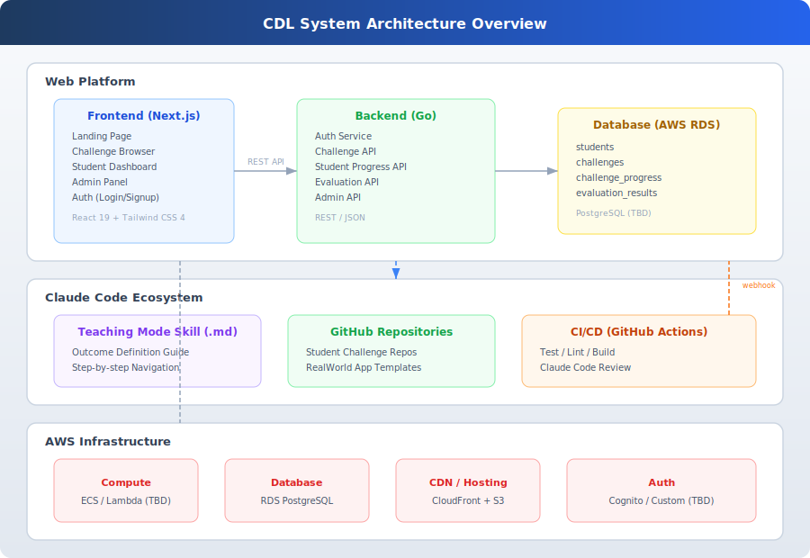
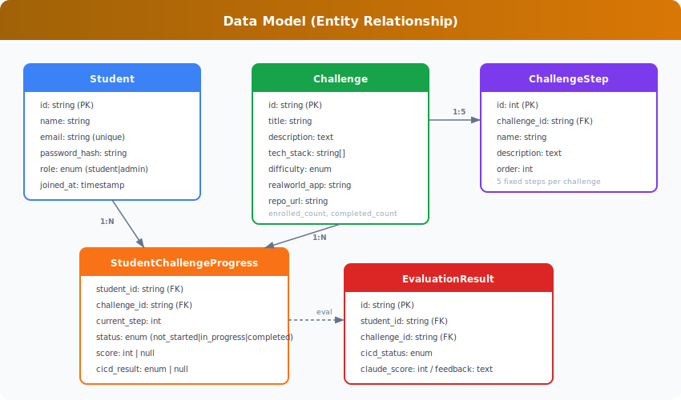
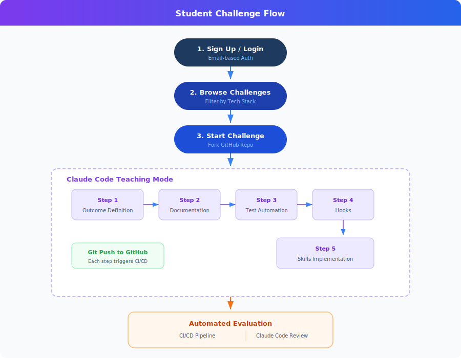
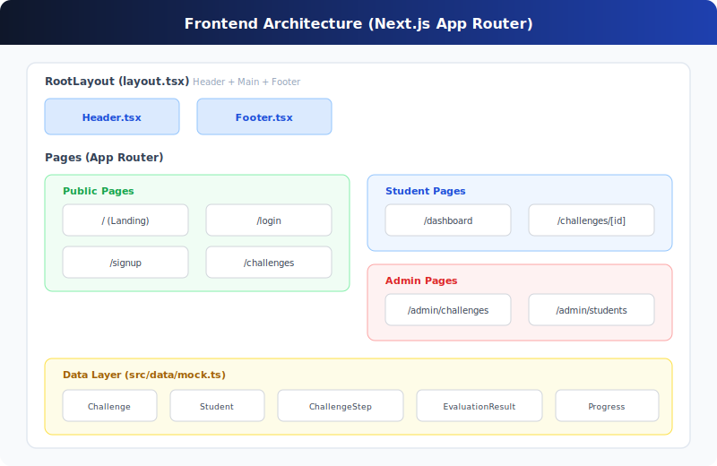

# Challenge Driven Learning (CDL)

한빛미디어 온라인 교육 플랫폼 - **"강의 없이 챌린지만으로 학습한다."**

CDL은 수강생이 코드를 직접 작성하거나 볼 필요 없이, Claude Code를 활용하여 원하는 결과물을 얻는 방법을 학습하는 교육 플랫폼입니다.

---

## Architecture

> 상세 문서: [docs/ARCHITECTURE.md](./docs/ARCHITECTURE.md)

### System Overview



### Tech Stack

| Layer | Technology |
|-------|-----------|
| Frontend | Next.js 16 + React 19 + Tailwind CSS 4 |
| Backend | Go (REST API) - 설계 예정 |
| Database | PostgreSQL (AWS RDS) - TBD |
| Infrastructure | AWS |
| CI/CD | GitHub Actions |

### Data Model



### User Flow



### Frontend Structure



---

## Core Concept

### Challenge-based Learning

수강생은 리얼월드 앱 구현체를 소재로 5단계 챌린지를 수행합니다:

```
1. 결과물 정의 (Outcome Definition)
2. 문서화 (Documentation)
3. 테스트 자동화 (Test Automation)
4. 훅 구현 (Hooks)
5. 스킬 구현 (Skills)
```

### Teaching Mode Plugin

Claude Code 슬래시 커맨드(스킬) 형태의 학습 가이드로, 수강생이 결과물 정의에 집중하도록 안내합니다.

### Automated Evaluation

| Layer | 평가 내용 |
|-------|----------|
| CI/CD (GitHub Actions) | 테스트 통과, 린트, 커버리지, 빌드 |
| Claude Code Review | 산출물 품질 검토, 개선 피드백 |

---

## Project Structure

```
CDL/
├── frontend/               # Next.js 웹 애플리케이션
│   ├── src/
│   │   ├── app/            # Pages (App Router)
│   │   ├── components/     # Shared components
│   │   └── data/           # Mock data + interfaces
│   └── package.json
├── docs/
│   ├── PRD.md              # Product Requirements Document
│   ├── ARCHITECTURE.md     # Architecture Document
│   └── architecture/       # SVG diagrams
│       ├── system-overview.svg
│       ├── user-flow.svg
│       ├── frontend-structure.svg
│       └── data-model.svg
└── README.md
```

---

## Getting Started

### Prerequisites

- Node.js 18+
- npm or yarn

### Frontend Development

```bash
cd frontend
npm install
npm run dev
```

Open [http://localhost:3000](http://localhost:3000)

---

## Pages

| Route | Description |
|-------|-------------|
| `/` | 랜딩 페이지 |
| `/challenges` | 챌린지 목록 (기술스택 필터) |
| `/challenges/[id]` | 챌린지 상세 + 5단계 스텝퍼 |
| `/dashboard` | 수강생 대시보드 |
| `/login` | 로그인 |
| `/signup` | 회원가입 |
| `/admin/challenges` | 챌린지 관리 (Admin) |
| `/admin/students` | 수강생 모니터링 (Admin) |

---

## Documentation

- [PRD (Product Requirements)](./docs/PRD.md)
- [Architecture](./docs/ARCHITECTURE.md)
