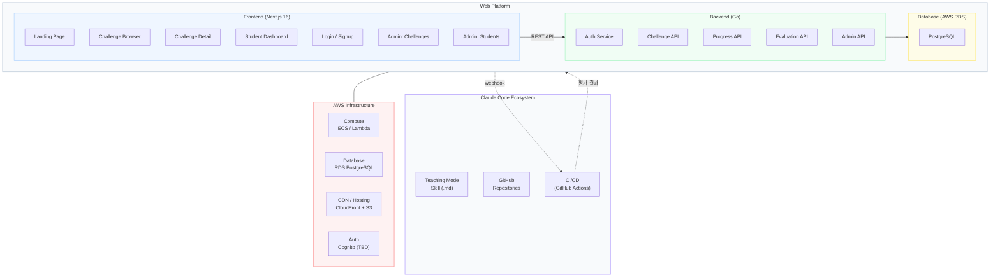
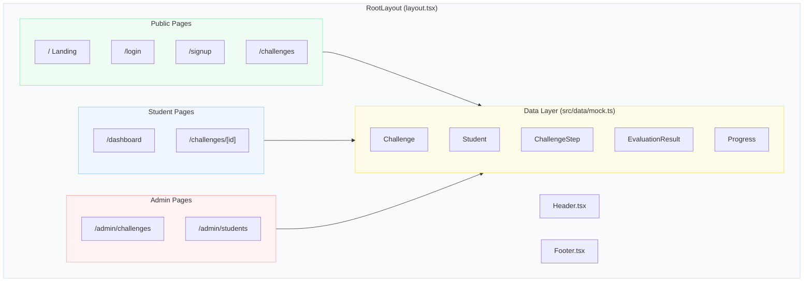
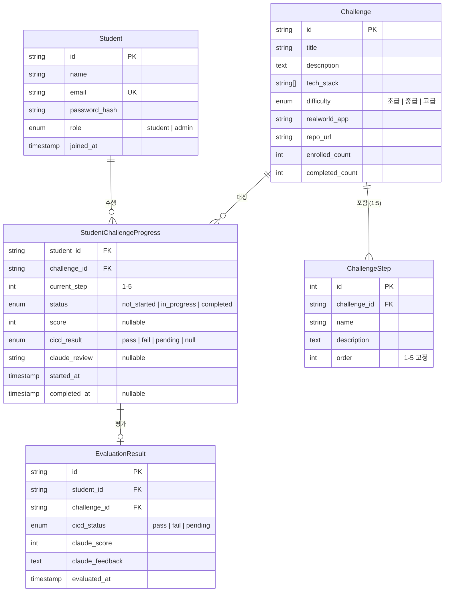
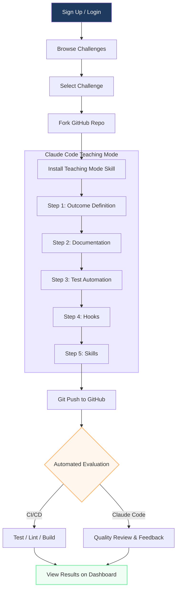
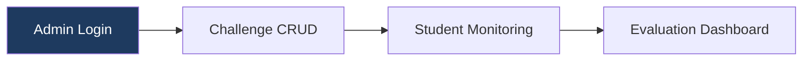
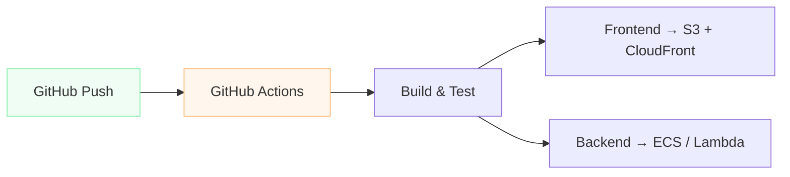

# CDL Architecture Document

**Version:** 1.0 (MVP)
**Last Updated:** 2026-03-20

---

## 1. System Overview

CDL(Challenge Driven Learning)은 한빛미디어의 온라인 교육 플랫폼으로, 강의 없이 챌린지만으로 학습하는 새로운 교육 방식을 제공합니다.



### 핵심 설계 원칙

| 원칙 | 설명 |
|------|------|
| **챌린지 중심** | 전통적 강의 없이 프로젝트형 챌린지로 학습 |
| **결과물 정의 우선** | 코드 작성이 아닌 결과물 정의 능력 배양 |
| **자동화된 평가** | CI/CD + Claude Code 리뷰 병행 자동 평가 |
| **AI 네이티브** | Claude Code 티칭모드를 학습 가이드로 활용 |

---

## 2. Tech Stack

| Layer | Technology | Status |
|-------|-----------|--------|
| **Frontend** | Next.js 16 + React 19 + Tailwind CSS 4 | MVP 구현 중 |
| **Backend** | Go (REST API) | 설계 예정 |
| **Database** | PostgreSQL (AWS RDS) | TBD |
| **Infrastructure** | AWS (ECS/Lambda, CloudFront, S3, RDS) | TBD |
| **CI/CD** | GitHub Actions | 설계 예정 |
| **Authentication** | Email-based (Cognito or Custom) | TBD |

---

## 3. Frontend Architecture

Next.js App Router 기반의 SPA로, 현재 Mock 데이터로 UI 프로토타입이 구현되어 있습니다.



### 3.1 디렉토리 구조

```
frontend/
├── src/
│   ├── app/                    # Next.js App Router pages
│   │   ├── layout.tsx          # Root layout (Header + Footer)
│   │   ├── page.tsx            # Landing page
│   │   ├── login/page.tsx      # Login
│   │   ├── signup/page.tsx     # Sign up
│   │   ├── challenges/
│   │   │   ├── page.tsx        # Challenge browser (filter by tech stack)
│   │   │   └── [id]/page.tsx   # Challenge detail + stepper + evaluation
│   │   ├── dashboard/page.tsx  # Student dashboard
│   │   └── admin/
│   │       ├── challenges/page.tsx  # Challenge CRUD
│   │       └── students/page.tsx    # Student monitoring
│   ├── components/
│   │   ├── Header.tsx          # Global navigation + mobile menu
│   │   └── Footer.tsx          # Site footer
│   └── data/
│       └── mock.ts             # Mock data + TypeScript interfaces
├── package.json
├── next.config.ts
├── tsconfig.json
└── tailwind / postcss config
```

### 3.2 Page 구성

| Route | 역할 | 인증 필요 |
|-------|------|----------|
| `/` | 랜딩 페이지 (Hero, Features, CTA) | No |
| `/login` | 이메일 로그인 | No |
| `/signup` | 회원가입 | No |
| `/challenges` | 챌린지 목록 (기술스택 필터) | No |
| `/challenges/[id]` | 챌린지 상세 (5단계 스텝퍼, 평가결과, 티칭모드 설치) | Yes |
| `/dashboard` | 수강생 대시보드 (진행현황, 완료현황, 평가결과) | Yes |
| `/admin/challenges` | 챌린지 CRUD 관리 | Admin |
| `/admin/students` | 수강생 모니터링 (통계, 상세 진행현황) | Admin |

### 3.3 현재 상태 (MVP)

- **UI 프로토타입 완성**: 모든 페이지 Mock 데이터로 렌더링
- **인증 미연동**: 로그인/회원가입 폼만 존재 (백엔드 미구현)
- **데이터 레이어**: `src/data/mock.ts`에 TypeScript interface + 샘플 데이터
- **반응형**: Tailwind CSS 기반 모바일/데스크톱 대응

---

## 4. Data Model



### 4.1 Core Entities

#### Student
| Field | Type | Description |
|-------|------|-------------|
| id | string (PK) | 고유 식별자 |
| name | string | 이름 |
| email | string (unique) | 이메일 (로그인 ID) |
| role | enum | student / admin |
| joined_at | timestamp | 가입일 |

#### Challenge
| Field | Type | Description |
|-------|------|-------------|
| id | string (PK) | 고유 식별자 |
| title | string | 챌린지 제목 |
| description | text | 설명 |
| tech_stack | string[] | 기술스택 태그 |
| difficulty | enum | 초급 / 중급 / 고급 |
| realworld_app | string | 리얼월드 앱 이름 |
| repo_url | string | GitHub 리포 URL |

#### ChallengeStep (고정 5단계)
1. 결과물 정의 (Outcome Definition)
2. 문서화 (Documentation)
3. 테스트 자동화 (Test Automation)
4. 훅 구현 (Hooks)
5. 스킬 구현 (Skills)

#### StudentChallengeProgress
| Field | Type | Description |
|-------|------|-------------|
| student_id | FK | Student 참조 |
| challenge_id | FK | Challenge 참조 |
| current_step | int | 현재 진행 단계 (1-5) |
| status | enum | not_started / in_progress / completed |
| score | int? | 평가 점수 |
| cicd_result | enum? | pass / fail / pending |

#### EvaluationResult
| Field | Type | Description |
|-------|------|-------------|
| id | string (PK) | 고유 식별자 |
| student_id | FK | Student 참조 |
| challenge_id | FK | Challenge 참조 |
| cicd_status | enum | pass / fail / pending |
| claude_score | int | Claude Code 평가 점수 |
| claude_feedback | text | Claude Code 피드백 |

---

## 5. User Flow



### 5.1 수강생 플로우

```
회원가입/로그인 → 챌린지 목록 → 챌린지 선택 → GitHub 리포 Fork
  → 티칭모드 스킬 설치 → 5단계 진행 → 자동 평가 → 결과 확인
```

### 5.2 관리자 플로우



---

## 6. Claude Code Ecosystem

### 6.1 티칭모드 플러그인

- **형태**: Claude Code Skill (`.md` 파일)
- **설치**: `claude skill install cdl-teaching-mode`
- **역할**: 챌린지 진행 시 학습 가이드
- **동작**: 결과물 정의에 집중하도록 안내, 단계별 진행 추적

### 6.2 자동 평가 시스템

| Layer | 담당 | 평가 내용 |
|-------|------|----------|
| **CI/CD** (GitHub Actions) | 자동 | 테스트 통과, 린트, 커버리지, 빌드 |
| **Claude Code Review** | 자동 | 산출물 품질, 개선 피드백 |

평가 결과는 Webhook으로 웹 플랫폼에 전달되어 대시보드에 표시됩니다.

---

## 7. Infrastructure (Planned)

### AWS 구성 (예정)

| Service | 용도 |
|---------|------|
| **ECS / Lambda** | Go Backend 호스팅 |
| **RDS PostgreSQL** | 데이터베이스 |
| **CloudFront + S3** | Frontend 정적 호스팅 |
| **Cognito** | 인증 (또는 Custom Auth) |
| **GitHub Actions** | CI/CD 파이프라인 |

### 배포 전략



---

## 8. 향후 확장 고려사항

| 항목 | 설명 | 우선순위 |
|------|------|---------|
| 결제 시스템 | 수강료 결제 연동 | Post-MVP |
| 소셜 로그인 | GitHub, Google OAuth | Post-MVP |
| 실시간 알림 | WebSocket 기반 진행 알림 | P2 |
| 수강생 포럼 | 커뮤니티 기능 | Post-MVP |
| 한빛미디어 연동 | 기존 플랫폼과 SSO | Post-MVP |
